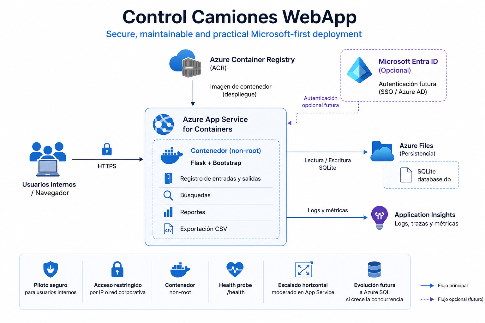

# 🚚 Truck Control Web App

A lightweight web application for managing and monitoring truck entry and exit at logistics facilities (warehouses, distribution centers, loading docks).

> **Bilingual README** — [English](#english) | [Español](#español)

## Azure MVP Architecture



---

## English

### Overview

Truck Control Web App is a Flask-based web application that registers and controls vehicle flow at logistics facilities. It tracks entries and exits, lists trucks currently on-site, searches historical records, generates date-range reports, and exports data to CSV.

### Features

- Register truck entries and exits (toggle based on plate number)
- List trucks currently inside the facility
- Search by tractor plate, trailer plate, company, or shipment number
- Date-range reports with CSV export
- Filter by warehouse location and operation type (loading/unloading)
- Explicit `.env` loading plus configurable timezone and database path via environment variables
- Real `/health` endpoint for container probes and Azure readiness checks
- Docker-ready with non-root user, basic security headers, and startup logging

### Tech Stack

| Layer | Technology |
|-------|-----------|
| Backend | Flask 3.1 (Python 3.12+) |
| Frontend | HTML, CSS, JavaScript, Bootstrap 5 |
| Database | SQLite (zero-config, file-based) |
| WSGI Server | Gunicorn |
| Container | Docker (Python 3.12-slim) |

### Quick Start

#### Option A — Run locally with Python

```bash
# 1. Clone the repository
git clone https://github.com/Nambu89/Control_Camiones_WebApp.git
cd Control_Camiones_WebApp

# 2. Create and activate a virtual environment
python -m venv venv
source venv/bin/activate        # Linux/macOS
venv\Scripts\activate           # Windows

# 3. Install dependencies
pip install -r requirements.txt

# 4. (Optional) Configure environment
cp .env.example .env            # Linux/macOS
copy .env.example .env          # Windows

# 5. Run the app
python app.py
```

The app will be available at `http://localhost:5000`.

#### Option B — Run with Docker

```bash
# Build the image
docker build -t truck-control .

# Run with persistent database storage
docker run -d -p 5000:5000 \
  -v $(pwd)/data:/app/data \
  -e DATABASE_PATH=/app/data/database.db \
  --name truck-control-app \
  truck-control
```

The app will be available at `http://localhost:5000`.

### Configuration

All settings are optional and controlled via environment variables. See [`.env.example`](.env.example) for details.

| Variable | Default | Description |
|----------|---------|-------------|
| `DATABASE_PATH` | `database.db` | Path to the SQLite database file |
| `APP_TIMEZONE` | `Europe/Madrid` | IANA timezone for timestamps |
| `FLASK_DEBUG` | `0` | Debug mode (`1` for development, `0` for production) |
| `PORT` | `5000` | Port the app listens on |
| `LOG_LEVEL` | `INFO` | Application log level (`DEBUG`, `INFO`, `WARNING`, ...) |
| `MAX_CONTENT_LENGTH` | `262144` | Maximum accepted request size in bytes |

`.env` files are loaded automatically at startup when present, so the documented local workflow now matches the application behavior.

### Deploying to Azure

This app is designed to deploy cleanly on Microsoft Azure. The Dockerfile is compatible with **Azure App Service for Containers** and **Azure Container Apps**.

#### Azure App Service for Containers

1. Build and push the image to Azure Container Registry (ACR):
   ```bash
   az acr build --registry <your-registry> --image truck-control .
   ```
2. Create an App Service plan (Linux, B1 or higher):
   ```bash
   az appservice plan create --name truck-control-plan --resource-group <rg> --is-linux --sku B1
   ```
3. Create the web app from the container image:
   ```bash
   az webapp create --name truck-control-app --resource-group <rg> \
     --plan truck-control-plan --deployment-container-image-name <your-registry>.azurecr.io/truck-control:latest
   ```
4. Configure environment variables in the Azure Portal → **Configuration** → **Application settings**:
   - `DATABASE_PATH` → `/home/data/database.db` (use Azure Files mount for persistence)
   - `APP_TIMEZONE` → your timezone
   - `LOG_LEVEL` → `INFO`
   - `PORT` → `5000`

#### Azure Container Apps

```bash
az containerapp create \
  --name truck-control \
  --resource-group <rg> \
  --image <your-registry>.azurecr.io/truck-control:latest \
  --target-port 5000 \
  --ingress external \
  --env-vars DATABASE_PATH=/data/database.db APP_TIMEZONE=Europe/Madrid LOG_LEVEL=INFO
```

#### Optional Azure integrations

- **Azure SQL Database**: replace SQLite with Azure SQL by swapping the `sqlite3` connection for `pyodbc` or `SQLAlchemy`. The schema is simple (single table).
- **Microsoft Entra ID**: add authentication via `MSAL` (Microsoft Authentication Library) and protect routes with `@login_required`.
- **Application Insights**: add the OpenTelemetry-based App Insights instrumentation package (`opentelemetry-instrumentation-flask`) for request telemetry, logging, and error tracking.

### MVP Azure Posture

For a defendable Azure MVP without a major rewrite, this repository now assumes the following baseline posture:

- Containerized deployment on **Azure App Service for Containers** or **Azure Container Apps**
- Configuration via App Settings / environment variables, with local `.env` support only for development
- **SQLite persisted on a mounted volume** for pilot scope or single-site usage
- Non-root container, debug disabled in production, and conservative response headers
- `/health` endpoint usable by Docker, Azure probes, or external monitors
- Structured stdout logging ready for Azure log streaming

Recommended next hardening steps after MVP:

- Restrict ingress to trusted corporate IPs or front the app with Azure Application Gateway / WAF
- Add Microsoft Entra ID or Azure Easy Auth before exposing the app broadly
- Move from SQLite to Azure SQL if concurrent usage or multi-site scope increases
- Add Application Insights for telemetry and alerting

### Project Structure

```
.
├── app.py                 # Flask application (routes, logic, DB)
├── requirements.txt       # Python dependencies
├── Dockerfile             # Container build definition
├── Procfile               # PaaS deployment (Heroku, Render, etc.)
├── .env.example           # Environment variable template
├── .dockerignore
├── .gitignore
├── LICENSE
├── CONTRIBUTING.md
├── static/
│   └── style.css          # Custom styles
├── templates/             # Jinja2 HTML templates
│   ├── base.html
│   ├── index.html
│   ├── list.html
│   ├── search.html
│   ├── report.html
│   └── edit.html
└── docs/                  # Detailed documentation (Spanish)
```

### Documentation

Detailed documentation is available in the [`docs/`](docs/) folder (in Spanish):

- [Visión General](docs/general/vision_general.md)
- [Arquitectura](docs/arquitectura/arquitectura.md)
- [Arquitectura Azure MVP](docs/arquitectura/azure_mvp.md)
- [Diagrama Azure MVP](docs/arquitectura/azure_mvp_diagrama.md)
- [Instalación](docs/instalacion/instalacion.md)
- [Despliegue](docs/despliegue/despliegue.md)
- [API y Endpoints](docs/api/api.md)
- [Base de Datos](docs/base_datos/base_datos.md)
- [Guía de Usuario](docs/guia_usuario/guia_usuario.md)
- [Mantenimiento](docs/mantenimiento/mantenimiento.md)
- [Diagram placeholders](docs/diagrams/README.md)

### Contributing

See [CONTRIBUTING.md](CONTRIBUTING.md). Contributions are welcome!

### License

This project is licensed under the [MIT License](LICENSE).

---

## Español

### Descripción General

Truck Control Web App es una aplicación web desarrollada con Flask que permite registrar y controlar el flujo de vehículos en instalaciones logísticas. Facilita el registro de entradas y salidas, la búsqueda de registros históricos, la generación de reportes y la exportación de datos.

### Características

- Registro de entradas y salidas de camiones (conmutación por matrícula)
- Listado de camiones actualmente dentro de las instalaciones
- Búsqueda por matrícula tractora, matrícula remolque, empresa o número de envío
- Reportes por rango de fechas con exportación a CSV
- Filtrado por almacén y tipo de operación (carga/descarga)
- Carga explícita de `.env` y configuración por variables de entorno
- Endpoint real `/health`, cabeceras de seguridad básicas y logging de arranque
- Listo para Docker con usuario no-root

### Tecnologías

| Capa | Tecnología |
|------|-----------|
| Backend | Flask 3.1 (Python 3.12+) |
| Frontend | HTML, CSS, JavaScript, Bootstrap 5 |
| Base de Datos | SQLite (sin configuración, basada en archivo) |
| Servidor WSGI | Gunicorn |
| Contenedor | Docker (Python 3.12-slim) |

### Inicio Rápido

#### Opción A — Ejecutar localmente con Python

```bash
# 1. Clonar el repositorio
git clone https://github.com/Nambu89/Control_Camiones_WebApp.git
cd Control_Camiones_WebApp

# 2. Crear y activar un entorno virtual
python -m venv venv
source venv/bin/activate        # Linux/macOS
venv\Scripts\activate           # Windows

# 3. Instalar dependencias
pip install -r requirements.txt

# 4. (Opcional) Configurar entorno
cp .env.example .env            # Linux/macOS
copy .env.example .env          # Windows

# 5. Ejecutar la aplicación
python app.py
```

La aplicación estará disponible en `http://localhost:5000`.

#### Opción B — Ejecutar con Docker

```bash
# Construir la imagen
docker build -t truck-control .

# Ejecutar con almacenamiento persistente
docker run -d -p 5000:5000 \
  -v $(pwd)/data:/app/data \
  -e DATABASE_PATH=/app/data/database.db \
  --name truck-control-app \
  truck-control
```

La aplicación estará disponible en `http://localhost:5000`.

### Configuración

Todos los ajustes son opcionales y se controlan mediante variables de entorno. Ver [`.env.example`](.env.example) para más detalles.

| Variable | Valor por defecto | Descripción |
|----------|-------------------|-------------|
| `DATABASE_PATH` | `database.db` | Ruta al archivo de base de datos SQLite |
| `APP_TIMEZONE` | `Europe/Madrid` | Zona horaria IANA para los registros |
| `FLASK_DEBUG` | `0` | Modo debug (`1` para desarrollo, `0` para producción) |
| `PORT` | `5000` | Puerto de escucha de la aplicación |
| `LOG_LEVEL` | `INFO` | Nivel de log de la aplicación |
| `MAX_CONTENT_LENGTH` | `262144` | Tamaño máximo aceptado por petición en bytes |

Si existe un archivo `.env`, la aplicación lo carga automáticamente al arrancar.

### Despliegue en Azure

Esta aplicación está diseñada para desplegarse de forma limpia en Microsoft Azure. El Dockerfile es compatible con **Azure App Service for Containers** y **Azure Container Apps**.

#### Azure App Service for Containers

1. Construir y subir la imagen a Azure Container Registry (ACR):
   ```bash
   az acr build --registry <your-registry> --image truck-control .
   ```
2. Crear un plan de App Service (Linux, B1 o superior):
   ```bash
   az appservice plan create --name truck-control-plan --resource-group <rg> --is-linux --sku B1
   ```
3. Crear la web app desde la imagen del contenedor:
   ```bash
   az webapp create --name truck-control-app --resource-group <rg> \
     --plan truck-control-plan --deployment-container-image-name <your-registry>.azurecr.io/truck-control:latest
   ```
4. Configurar variables de entorno en el Portal de Azure → **Configuration** → **Application settings**:
   - `DATABASE_PATH` → `/home/data/database.db` (usar montaje de Azure Files para persistencia)
   - `APP_TIMEZONE` → tu zona horaria
   - `LOG_LEVEL` → `INFO`
   - `PORT` → `5000`

#### Azure Container Apps

```bash
az containerapp create \
  --name truck-control \
  --resource-group <rg> \
  --image <your-registry>.azurecr.io/truck-control:latest \
  --target-port 5000 \
  --ingress external \
  --env-vars DATABASE_PATH=/data/database.db APP_TIMEZONE=Europe/Madrid LOG_LEVEL=INFO
```

#### Integraciones opcionales de Azure

- **Azure SQL Database**: reemplazar SQLite con Azure SQL cambiando la conexión `sqlite3` por `pyodbc` o `SQLAlchemy`. El esquema es simple (una sola tabla).
- **Microsoft Entra ID**: añadir autenticación mediante `MSAL` (Microsoft Authentication Library) y proteger rutas con `@login_required`.
- **Application Insights**: añadir el paquete de instrumentación basado en OpenTelemetry (`opentelemetry-instrumentation-flask`) para telemetría de peticiones, logs y seguimiento de errores.

### Postura Azure para MVP

Para defender este repositorio como MVP en Azure sin reescribirlo, la base propuesta es:

- Despliegue contenedorizado en **Azure App Service for Containers** o **Azure Container Apps**
- Configuración por App Settings / variables de entorno, con `.env` solo para desarrollo local
- **SQLite con volumen montado** para pilotos o una única instalación
- Contenedor sin privilegios, `FLASK_DEBUG=0` en producción y cabeceras HTTP defensivas
- Endpoint `/health` utilizable por Docker y por sondas de plataforma
- Logs por stdout, listos para Azure Log Stream

Siguientes pasos recomendados cuando el MVP se abra a más usuarios o sedes:

- Restringir acceso por IP o colocar la app detrás de Application Gateway / WAF
- Añadir Microsoft Entra ID o Easy Auth antes de exponerla de forma amplia
- Migrar de SQLite a Azure SQL si crece la concurrencia o el alcance multi-sede
- Añadir Application Insights para observabilidad completa

### Estructura del Proyecto

```
.
├── app.py                 # Aplicación Flask (rutas, lógica, BD)
├── requirements.txt       # Dependencias de Python
├── Dockerfile             # Definición de build del contenedor
├── Procfile               # Despliegue PaaS (Heroku, Render, etc.)
├── .env.example           # Plantilla de variables de entorno
├── .dockerignore
├── .gitignore
├── LICENSE
├── CONTRIBUTING.md
├── static/
│   └── style.css          # Estilos personalizados
├── templates/             # Plantillas HTML Jinja2
│   ├── base.html
│   ├── index.html
│   ├── list.html
│   ├── search.html
│   ├── report.html
│   └── edit.html
└── docs/                  # Documentación detallada (en español)
```

### Documentación

La documentación completa se encuentra en la carpeta [`docs/`](docs/):

- [Visión General](docs/general/vision_general.md)
- [Arquitectura](docs/arquitectura/arquitectura.md)
- [Arquitectura Azure MVP](docs/arquitectura/azure_mvp.md)
- [Instalación](docs/instalacion/instalacion.md)
- [Despliegue](docs/despliegue/despliegue.md)
- [API y Endpoints](docs/api/api.md)
- [Base de Datos](docs/base_datos/base_datos.md)
- [Guía de Usuario](docs/guia_usuario/guia_usuario.md)
- [Mantenimiento](docs/mantenimiento/mantenimiento.md)
- [Marcadores para diagramas](docs/diagrams/README.md)

### Contribuir

Ver [CONTRIBUTING.md](CONTRIBUTING.md). ¡Las contribuciones son bienvenidas!

### Licencia

Este proyecto está licenciado bajo la [Licencia MIT](LICENSE).
