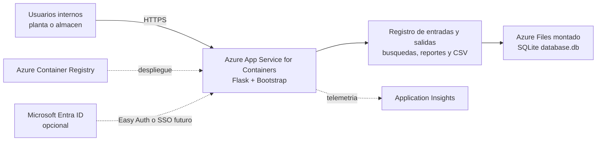

# Diagrama Azure MVP

## Objetivo

Reflejar una arquitectura Azure MVP realista para este repositorio sin forzar una reescritura: despliegue contenedorizado, persistencia sencilla, acceso controlado y observabilidad basica.

## Diagrama



## Flujo principal

1. El personal de operaciones accede por navegador a la aplicacion.
2. Flask registra entradas, salidas, busquedas y reportes sobre la base SQLite existente.
3. La base de datos se persiste en un volumen montado para evitar perdida de datos al reiniciar el contenedor.
4. Las sondas y la telemetria permiten detectar caidas, degradacion de base de datos o errores de aplicacion.

## Seguridad

- HTTPS only y acceso restringido a usuarios internos o IPs corporativas.
- Cabeceras HTTP defensivas ya contempladas por el repositorio.
- Contenedor non-root y configuracion por variables de entorno.
- `Microsoft Entra ID` o `Easy Auth` como siguiente paso natural antes de exponer la aplicacion mas alla de un piloto controlado.

## Observabilidad

- `GET /health` como sonda de plataforma.
- Logs de contenedor por stdout.
- Application Insights para peticiones, errores y tiempos de respuesta.
- Alertas basicas sobre disponibilidad y crecimiento anomalo de errores.

## Escalado y mantenibilidad

- Valido para piloto o una sede con carga moderada.
- Puede escalar horizontalmente a pocas replicas mientras SQLite siga en volumen compartido y el uso concurrente sea contenido.
- Si el alcance pasa a multi-sede o mayor concurrencia, el salto recomendado es migrar a Azure SQL manteniendo Flask y el contrato HTTP actual.

## Prompt Para Gemini

```text
Genera un diagrama de arquitectura Azure claro, profesional y visualmente ejecutivo para el repositorio "Control Camiones WebApp".

Usa iconos oficiales y actuales de Microsoft Azure. No inventes servicios que no aparecen en esta arquitectura.

Componentes obligatorios:
- Usuarios internos / navegador
- Azure App Service for Containers
- Azure Container Registry
- Application Insights
- Azure Files
- Microsoft Entra ID como componente opcional
- Dentro del App Service, indicar: Flask + Bootstrap, registro de entradas y salidas, busquedas, reportes y exportacion CSV
- En Azure Files, indicar: SQLite database.db

Flujos a dibujar:
- Usuarios -> HTTPS -> App Service
- App Service -> Azure Files para persistencia SQLite
- App Service -> Application Insights para logs y metricas
- ACR -> App Service como fuente de despliegue
- Entra ID -> App Service como autenticacion opcional futura

Notas visuales cortas:
- piloto seguro para usuarios internos
- health probe /health
- contenedor non-root
- acceso restringido por IP o red corporativa
- evolucion futura a Azure SQL si crece la concurrencia

Titulo sugerido: "Control Camiones WebApp - Azure MVP Architecture"
```
